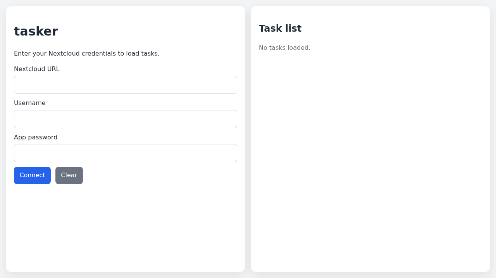
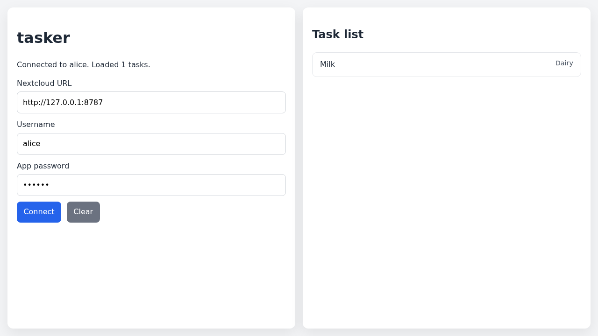

# Test: Authentication

As a user, I want to connect to my Nextcloud server and load my tasks.

## User sees the connection form

**Verifications:**
- [x] Nextcloud URL field visible
- [x] Connect button visible

---

## Tasks load after connecting

**Verifications:**
- [x] Status shows loaded task count
- [x] Task list shows the fetched task

---

