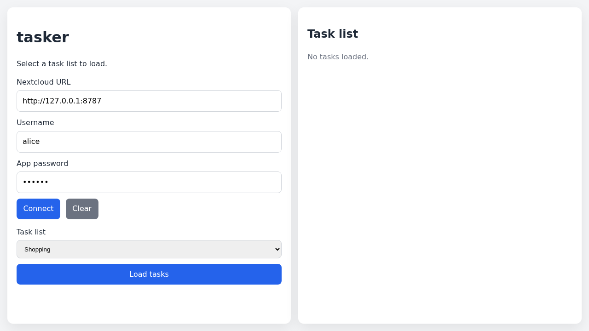
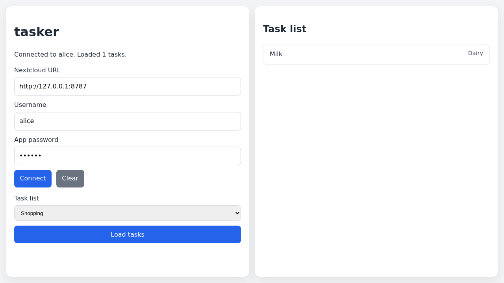

# Test: Authentication

As a user, I want to connect to my Nextcloud server, choose a task list, and load my tasks.

## User sees the connection form

**Verifications:**
- [x] Nextcloud URL field visible
- [x] Connect button visible

---

## Only the VTODO-capable task list is offered

**Verifications:**
- [x] Shopping task list option present
- [x] Personal (VEVENT-only) calendar is filtered out

---

## Tasks load after selecting a task list

**Verifications:**
- [x] Status shows loaded task count
- [x] Task list shows the fetched task

---

